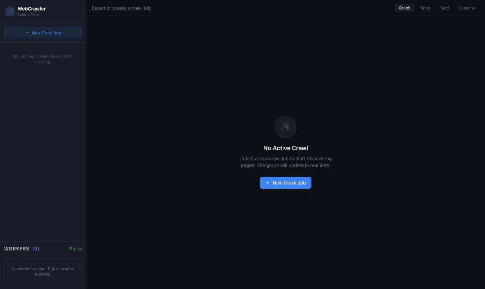

# Advanced Web Crawler

A distributed, production-grade web crawler with a real-time visualization dashboard. Watch every URL move through the pipeline — queued → fetching → parsed → stored or discarded — live across a fleet of parallel workers.



[](https://python.org)
[](https://fastapi.tiangolo.com)
[](https://docs.celeryq.dev)
[](https://redis.io)
[](https://react.dev)
[](https://docs.docker.com/compose)

---

## Features

- **Real-time dashboard** — WebSocket-pushed events for every URL state change, visualized with a live ReactFlow graph
- **Domain-sharded queues** — `md5(domain) % 16` routes each domain to a dedicated Celery queue so slow domains never block fast ones
- **Bloom filter deduplication** — sub-millisecond seen-URL checks without unbounded memory growth
- **Robots.txt compliance** — per-domain cache, honored by default
- **JS rendering** — optional Playwright support per job for SPA crawling
- **Discard tracking** — every filtered URL logged with exact reason: `duplicate`, `robots_txt`, `max_depth`, `wrong_domain`, etc.
- **Horizontal scaling** — add workers with a single command; Kubernetes HPA auto-scales 1→50
- **Live metrics** — pages/sec rate chart, queue depths per shard, bytes downloaded, active worker count

---

## Architecture

```
Browser ────── WebSocket ──── FastAPI ──────── Redis Streams (event bus)
                                  │
                            REST API
                            (jobs · metrics · graph · domains)
                                  │
                          SQLite (dev) / PostgreSQL (prod)

Celery Workers (1–50)
  ├── crawl.0 … crawl.15 (domain-sharded queues via Redis broker)
  │
  ├── Fetch  (aiohttp / Playwright)
  ├── Parse  (BeautifulSoup + lxml)
  ├── Filter (robots.txt · depth · domain · content-type · bloom filter)
  └── Emit   (Redis Stream → FastAPI → WebSocket → Dashboard)
```

**Domain sharding** maps `md5(domain) % 16` to one of 16 Celery queues. Same-domain requests stay serialized (politeness preserved). Different domains run fully in parallel across all 16 shards — eliminating slow-domain I/O head-of-line blocking.

---

## Tech Stack

| Layer | Technologies |
|---|---|
| **API** | Python 3.11, FastAPI, Uvicorn, WebSockets |
| **Workers** | Celery 5, aiohttp, Playwright (optional), BeautifulSoup, lxml |
| **Storage** | Redis (broker + streams + bloom filter), SQLite / PostgreSQL |
| **Frontend** | React 18, TypeScript, Vite, Zustand, ReactFlow, Recharts, Tailwind CSS |
| **Infra** | Docker Compose, Kubernetes + HPA, Celery Flower |

---

## Prerequisites

- **Python 3.11+**
- **Node.js 18+**
- **Redis 7+** (local install or Docker)
- **Git**

---

## Quick Start

### Local development

```bash
git clone https://github.com/ss-pratapIIITB/advanced-web-crawler.git
cd advanced-web-crawler

# 1. Copy and configure environment
cp .env.example .env

# 2. Backend
cd backend
python -m venv .venv && source .venv/bin/activate
pip install -r requirements.txt
cd ..

# 3. Frontend
cd frontend && npm install && cd ..

# 4. Start Redis (if not already running)
redis-server --daemonize yes

# 5. Launch everything
uvicorn backend.api.main:app --reload &        # API on :8000
celery -A backend.crawler.worker worker \
  --queues=$(seq -s, 0 15 | sed 's/[0-9]*/crawl.&/g') \
  --concurrency=4 &                             # 4 worker processes
cd frontend && npm run dev                      # Dashboard on :5173
```

Open **http://localhost:5173** for the dashboard and **http://localhost:8000/docs** for the interactive API explorer.

### Docker Compose (recommended)

```bash
docker compose up --build
# API   → http://localhost:8000
# UI    → http://localhost:5173
# Flower → http://localhost:5555
```

Scale workers without touching config:

```bash
docker compose up --scale worker=8
```

### Kubernetes

```bash
kubectl apply -f infra/k8s/
# HPA auto-scales workers from 1 → 50 based on CPU utilisation
```

---

## Environment Variables

Copy `.env.example` to `.env`. All values have sensible defaults for local dev.

| Variable | Default | Description |
|---|---|---|
| `REDIS_URL` | `redis://localhost:6379/0` | Redis connection for pub/sub and state |
| `CELERY_BROKER_URL` | `redis://localhost:6379/1` | Celery task broker |
| `CELERY_RESULT_BACKEND` | `redis://localhost:6379/2` | Celery result store |
| `DATABASE_URL` | `sqlite+aiosqlite:///./crawler.db` | Swap to PostgreSQL for prod |
| `MAX_DEPTH` | `3` | Default link-depth limit |
| `MAX_PAGES` | `10000` | Default hard stop per job |
| `CONCURRENCY` | `16` | Async fetch concurrency per worker |
| `POLITENESS_DELAY` | `1.0` | Seconds between requests to the same domain |
| `REQUEST_TIMEOUT` | `30` | Per-request timeout in seconds |

---

## Creating a Crawl Job

Via the dashboard UI or the REST API:

```bash
curl -X POST http://localhost:8000/api/v1/jobs \
  -H "Content-Type: application/json" \
  -d '{
    "seed_urls": ["https://example.com"],
    "max_depth": 3,
    "max_pages": 5000,
    "politeness_delay": 1.0,
    "respect_robots": true,
    "use_playwright": false,
    "allowed_domains": []
  }'
```

| Field | Description | Default |
|---|---|---|
| `seed_urls` | Starting URLs | required |
| `max_depth` | Link-depth limit | 3 |
| `max_pages` | Hard stop count | 10,000 |
| `politeness_delay` | Seconds between requests to the same domain | 1.0 |
| `respect_robots` | Honour `robots.txt` | `true` |
| `use_playwright` | JS rendering for SPAs (slower) | `false` |
| `allowed_domains` | Domain whitelist — empty means follow all | `[]` |

---

## REST API Reference

| Method | Endpoint | Description |
|---|---|---|
| `POST` | `/api/v1/jobs` | Create a crawl job |
| `POST` | `/api/v1/jobs/{id}/start` | Start / resume |
| `POST` | `/api/v1/jobs/{id}/pause` | Pause |
| `POST` | `/api/v1/jobs/{id}/stop` | Stop and clear frontier |
| `GET` | `/api/v1/jobs/{id}/metrics` | Live counters (queued, done, discarded, rate) |
| `GET` | `/api/v1/jobs/{id}/graph` | URL graph (nodes + edges) for visualization |
| `GET` | `/api/v1/jobs/{id}/pages` | Paginated crawled-page results |
| `GET` | `/api/v1/jobs/{id}/discards` | Discarded URLs with reasons |
| `GET` | `/api/v1/jobs/{id}/domains` | Per-domain stats + queue shard assignments |
| `GET` | `/api/v1/queues/stats` | Live depth of all 16 Celery queue shards |
| `GET` | `/api/v1/workers` | Connected worker states |
| `WS` | `/ws` | Real-time event stream for all job events |

Full interactive docs at **http://localhost:8000/docs**.

---

## Dashboard Views

| View | What you see |
|---|---|
| **Graph** | Live ReactFlow crawl graph — nodes coloured by status (`queued` grey → `fetching` blue → `stored` green → `discarded` red), edges show parent→child links |
| **Table** | Filterable URL table with status, HTTP code, links found, fetch time, and discard reason |
| **Feed** | Real-time event stream — every state transition as it happens |
| **Domains** | 16-cell shard heatmap showing which queue lanes are hot, plus per-domain table (pages crawled, avg fetch ms, active worker) |

---

## Project Structure

```
advanced-web-crawler/
├── backend/
│   ├── api/
│   │   ├── main.py          # FastAPI app, startup, CORS
│   │   ├── routes.py        # REST endpoints
│   │   └── websocket.py     # WebSocket hub + Redis Stream consumer
│   ├── crawler/
│   │   ├── worker.py        # Celery app + task definitions
│   │   ├── fetcher.py       # aiohttp / Playwright fetch layer
│   │   ├── parser.py        # BeautifulSoup link extraction
│   │   ├── filters.py       # robots.txt, depth, domain, bloom filter
│   │   ├── frontier.py      # Domain-sharded queue routing
│   │   └── events.py        # Redis Stream event emission
│   ├── models/
│   │   ├── crawl.py         # SQLAlchemy models (Job, Page, DiscardedURL)
│   │   └── events.py        # Pydantic event schemas
│   ├── storage/
│   │   └── database.py      # Async SQLAlchemy engine + session factory
│   ├── config.py            # Pydantic settings (reads from .env)
│   └── requirements.txt
├── frontend/
│   └── src/
│       ├── components/      # Dashboard, Graph, Table, Feed, Domains panels
│       ├── hooks/           # useApi, useWebSocket
│       ├── store/           # Zustand crawler state
│       └── types/           # Shared TypeScript types
├── infra/
│   └── k8s/                 # Kubernetes manifests (API, workers, Redis, HPA)
├── Dockerfile.api
├── Dockerfile.worker
├── docker-compose.yml
└── .env.example
```

---

## Scaling

Workers consume from all 16 shards simultaneously. Adding a worker increases throughput with zero config changes:

```bash
# Docker Compose
docker compose up --scale worker=16

# Kubernetes (or let HPA handle it automatically)
kubectl scale deployment crawler-worker --replicas=20
```

The domain-sharding design means 16 different domains can be fetched in true parallel even on a single worker. Each worker spawns 4 async coroutines × 16 queue shards = up to 64 concurrent in-flight requests per worker process.

---

## License

MIT
